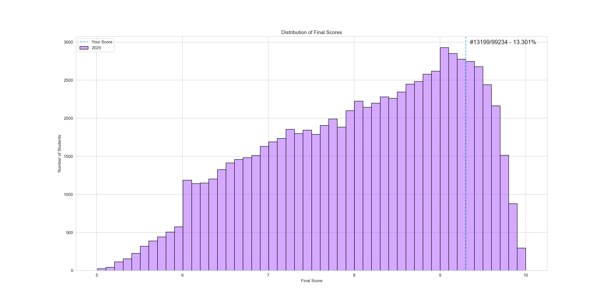
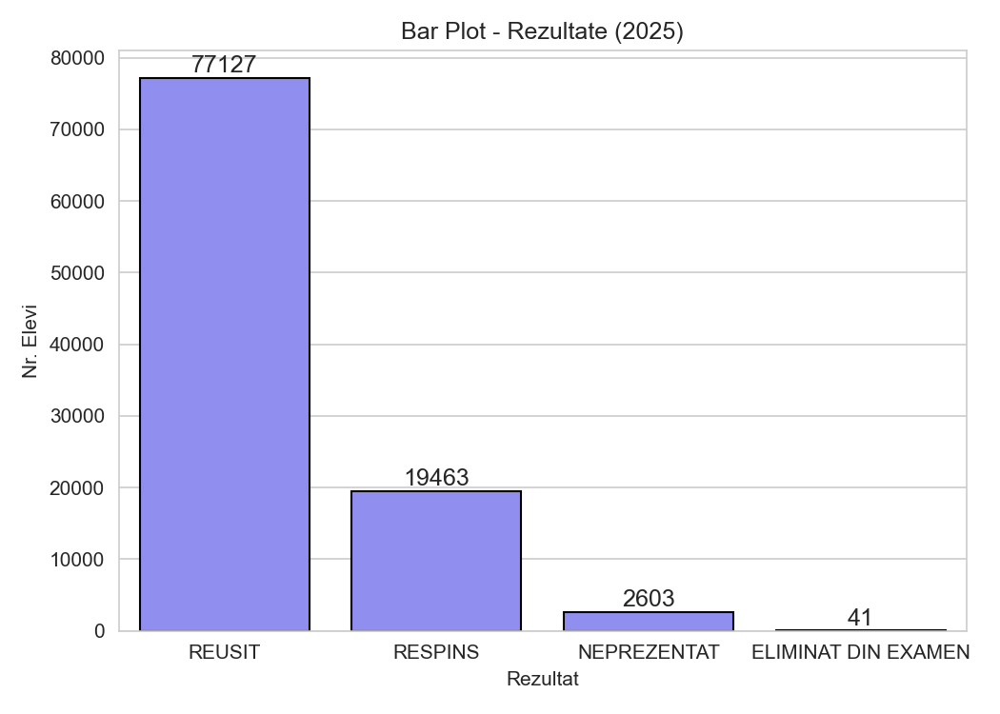
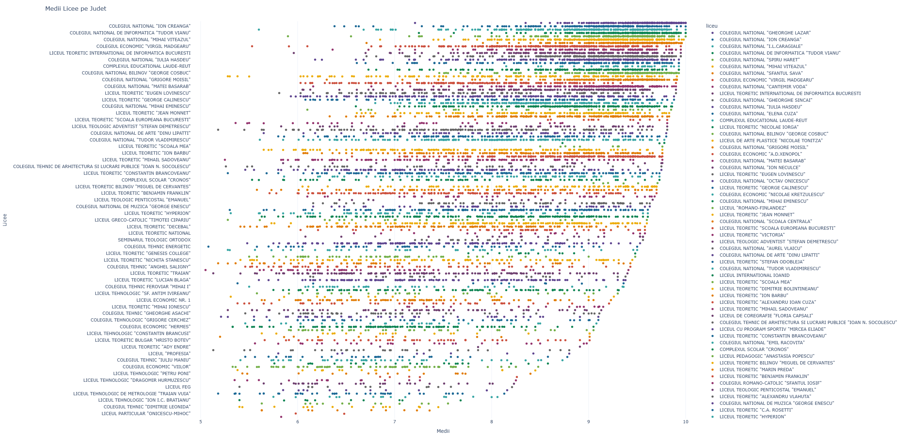
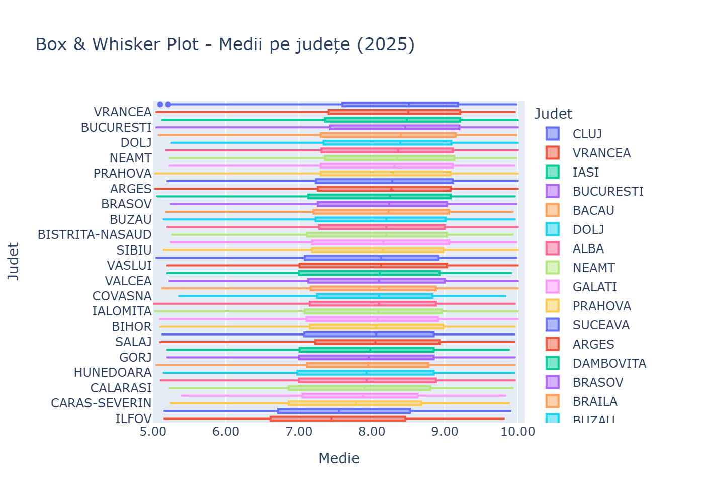
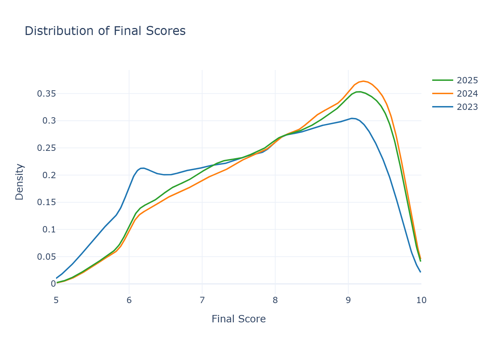

# 📊 BAC Analyzer

**BAC Analyzer** is a Python project designed to parse, store, and analyze data from the Romanian *Bacalaureat* exam results. The tool collects detailed student performance data across the last **three sessions** (years) of the exam and provides visual analytics for trends, distributions, and school-level performance insights.


---


## ⚙️ Features

- Parses and cleans *Bacalaureat* exam result data from official sources.
- Stores structured data in a **SQLite** database.
- Supports data from the **last 3 years** of exam sessions.
- `main.py` provides interactive options to generate visual plots and statistics.

### 🖼️ Graphs Demo:

<p align="center">
  
  
  
</p>
<p align="center">
  
  
</p>


---


## Technologies Used

| Purpose                | Technology |
|------------------------|------------|
| Data Parsing           | `BeautifulSoup`, `requests` |
| Data Storage           | `SQLite3` |
| Data Manipulation      | `pandas` |
| Data Visualization     | `matplotlib`, `seaborn`, `plotly` |


---


## ❓ How to Run

```bash
# Create and activate a virtual environment (optional but recommended)
python -m venv venv
venv\Scripts\activate

# Install the package
pip install . # Use '-e .' if you want to develop further

# Run the main CLI analysis tool and see help
bac-analyzer -h
```


---


## 📖 CLI Usage & Commands

### 1) `strip` — Strip Plot of Scores
Shows individual student scores (`medie`) grouped by high school in a given county.

**Arguments**
- `--year` *(int)* → Year of BAC exam (default: `2025`)
- `--county`, `--judet` *(str)* → Target county (default: `BUCURESTI`)

**Example**
```bash
bac-analyzer strip --year 2025 --county CLUJ
```

### 2) `box` — Box & Whisker Plot

Shows the distribution of median scores, either by county or by high school in a selected county.

**Arguments:**

- `--year` *(int)* → Year of BAC exam (default: `2025`)
- `--county`, `--judet` *(str)* → If specified, shows high school results inside that county. Otherwise, shows all counties.

**Example:**
```bash
bac-analyzer box --year 2025 --judet CLUJ
```

### 3) `bar` — Bar Plot of Outcomes

Shows categorical outcomes (`REUSIT`, `RESPINS`, `NEPREZENTAT`, `ELIMINAT DIN EXAMEN`).
Can be filtered to specific counties or high schools.

**Arguments:**

- `--year` *(int)* → Year of BAC exam (default: `2025`)
- `--county`, `--judet` *(str)* → Filter results by county
- `--highschool`, `--liceu` *(str)* → Filter by high school (for high schools containing commas, you have to backslash the interior commas \")

**Example:**
```bash
bac-analyzer bar --year 2023
```


### 4) `histogram` — Histogram of Scores

Shows score distributions across year, county or highschool.

**Arguments:**
- `--year` *(int)* → Year of BAC exam (default: `2025`)
- `--county`, `--judet` *(str)* → Filter by county
- `--highschool`, `--liceu` *(str)* → Filter by high school (for high schools containing commas, you have to backslash the interior commas \")
- `--score`, `--nota` *(float)* → Add a reference line at the specified score

**Example:**
```bash
bac-analyzer histogram --year 2023 --liceu "LICEUL TEORETIC \"AVRAM IANCU\""
```


### 5) `density` — Density Plot

Shows smooth distribution curves of scores.
By default: multiple years → multiple curves.
With --year: shows all counties inside that year
With --county: shows all high schools inside that county.

**Arguments:**
- `--year` *(int)* → Year to analyze (default: `2025`)
- `--county`, `--judet` *(str)* → If set, shows high school curves inside that county/year
- `--score`, `--nota` *(float)* → Add a reference line at the specified score

**Example:**
```bash
bac-analyzer density --year 2025 --judet ARGES --nota 8.5
```

### All counties:
`ALBA`,`ARGES`,`ARAD`,`BACAU`,`BIHOR`,`BISTRITA-NASAUD`,`BRAILA`,`BRASOV`,`BOTOSANI`,`BUZAU`,`CLUJ`,`CALARASI`,`CARAS-SEVERIN`,`CONSTANTA`,`COVASNA`,`DAMBOVITA`,`DOLJ`,`GORJ`,`GALATI`,`GIURGIU`,`HUNEDOARA`,`HARGHITA`,`IALOMITA`,`IASI`,`MEHEDINTI`,`MARAMURES`,`MURES`,`NEAMT`,`OLT`,`PRAHOVA`,`SIBIU`,`SALAJ`,`SATU-MARE`,`SUCEAVA`,`TULCEA`,`TIMIS`,`TELEORMAN`,`VALCEA`,`VRANCEA`,`VASLUI`,`ILFOV`,`BUCURESTI`


---